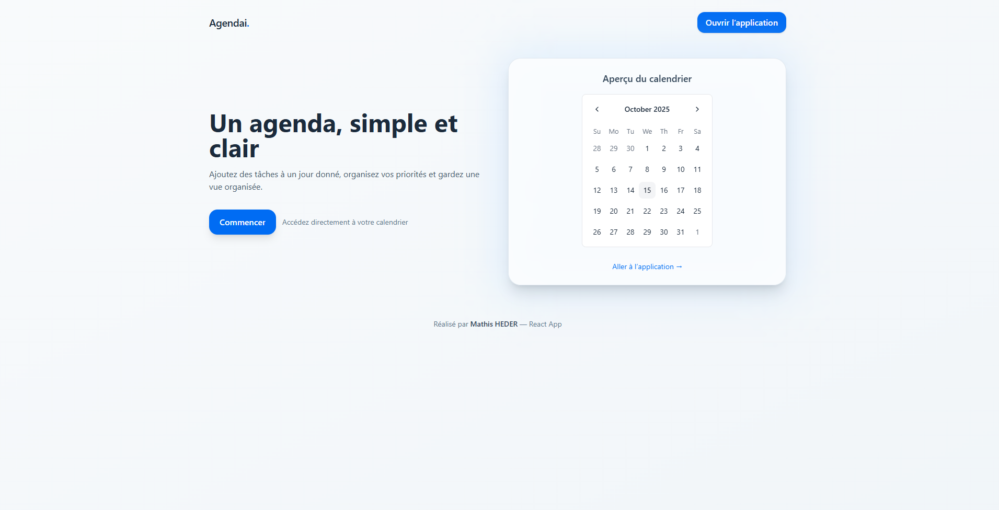
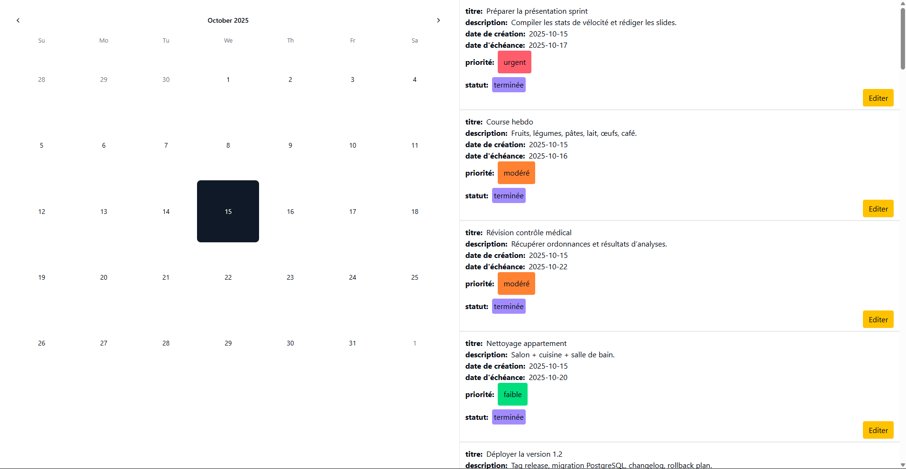

Un projet d’agenda numérique moderne permettant de visualiser, créer et gérer ses tâches quotidiennes.
L’application combine un frontend React (Vite + Tailwind) et un backend Python (FastAPI / SQLAlchemy / PostgreSQL).

Fonctionnalités principales

Affichage d’un calendrier interactif avec les tâches associées à chaque jour.

Gestion des tâches : création, suppression, état “terminé / à faire”.

Base de données PostgreSQL gérée avec SQLAlchemy.

Interface moderne et responsive avec Tailwind CSS.

Backend rapide et modulaire en Python.

1. **Créer le fichier .env**

À la racine du dossier backend, crée un fichier nommé .env contenant tes identifiants PostgreSQL :

DB_USER=postgres
DB_PASSWORD=admin
DB_HOST=localhost
DB_PORT=5432
DB_NAME=postgres

2. **Créer la base de données**

Exécuter :
python scripts/db.py

3. **Insérer la data**
python scripts/data.py

4. **Lancer le backend**

Toujours depuis le dossier backend :

python main.py

5. **Lancer le frontend**

Depuis le dossier frontend :

npm install
npm run dev

